

## Отчет

## Практическая работа 9

## Создание меню

---

**ФИО:** Лапшин Никита Евгеньевич  
**Курс:** 2
**Группа:** ИНС-б-о-24-1  
**Направление:** 09.03.02 «Информационные системы и технологии»  

---
### Вариант 9
### Цель работы

Изучить способы создания и обработки событий от различных типов меню в Android: главного меню (OptionsMenu) и контекстного меню (ContextMenu). Научиться динамически изменять интерфейс приложения с помощью пунктов меню.

### Ход работы

  
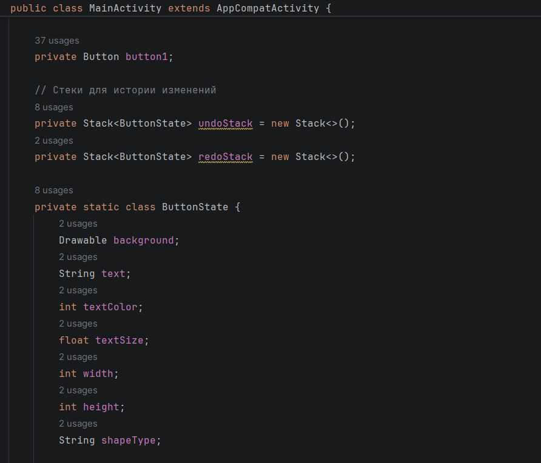

Рисунок 1 - Создание стеков для истории изменений

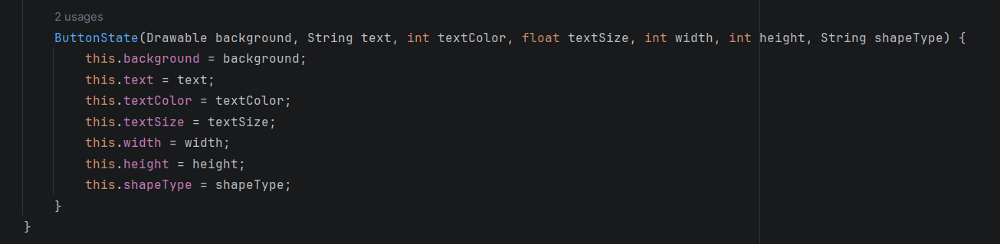

Рисунок 2 - Стек для хранения атрибутов

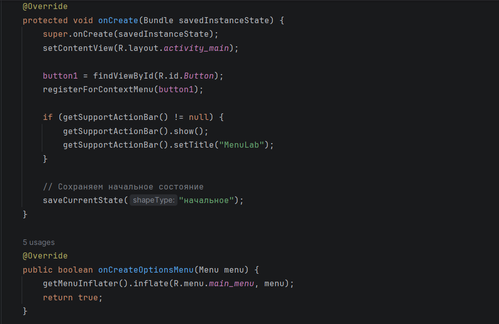

Рисунок 3 – Появление ActionBar и построение метода OptionsMenu

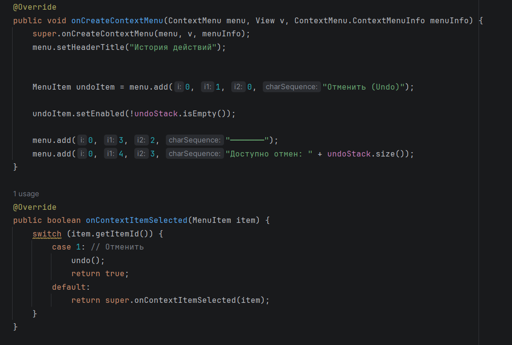

Рисунок 4 – Настройка контекстного меню

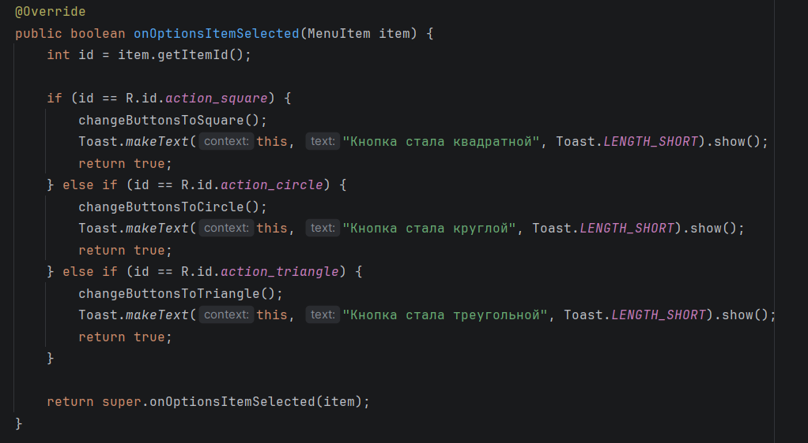

Рисунок 5 – Вывод Toast

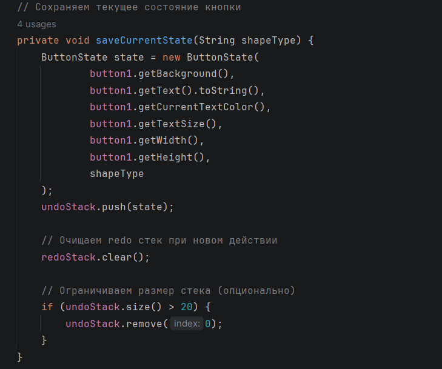

Рисунок 6 – Сохранение состояния кнопки и ограничение стека

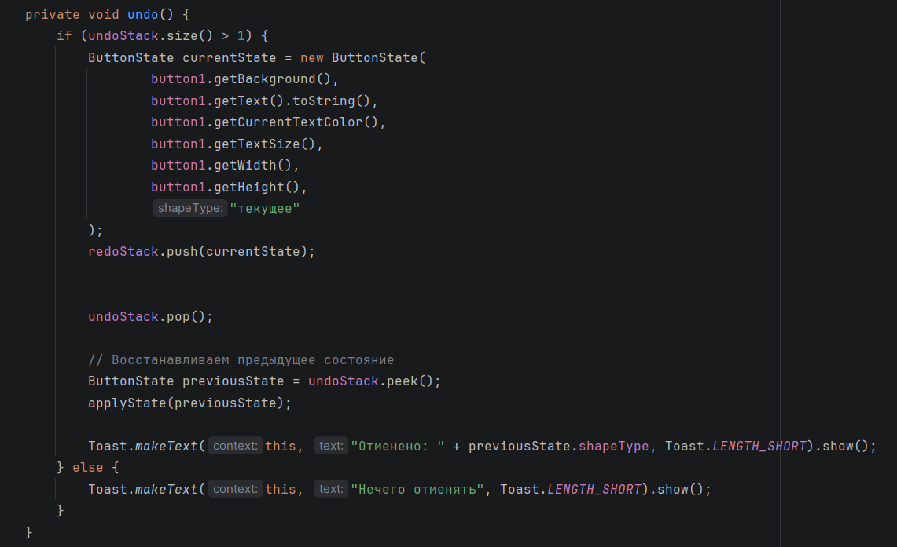

Рисунок 7 – Восстановление предыдущего состояния

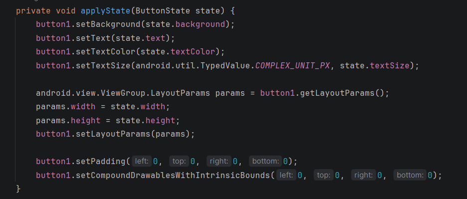

Рисунок 8 – Подтверждение состояния (параметров фигуры)

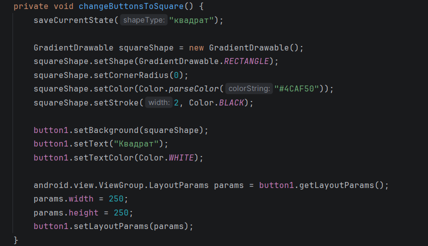

Рисунок 9 – Смена фигуры на квадрат

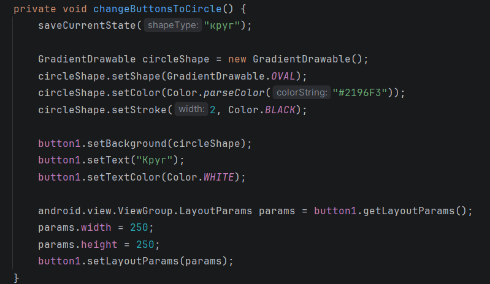

Рисунок 10 – Смена фигуры на круг

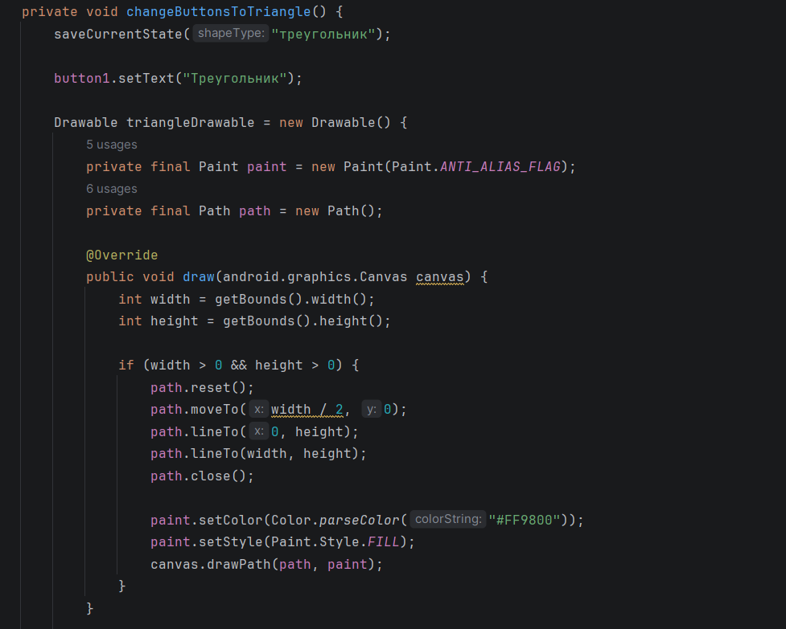

Рисунок 11 - Смена фигуры на треугольник

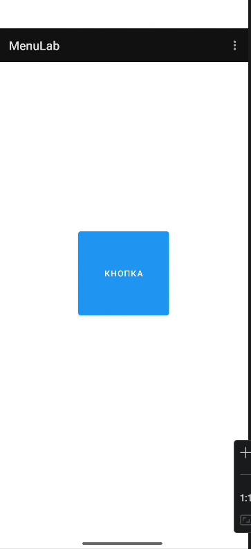

Рисунок 12 - Главный экран

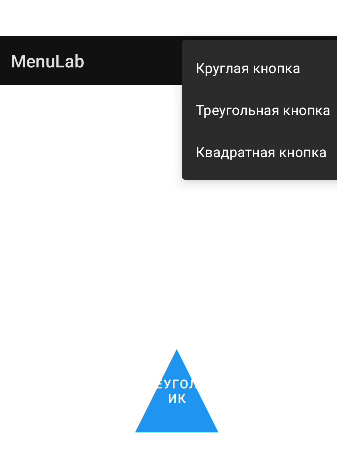

Рисунок 13 - Главное меню

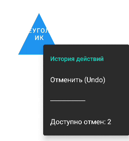

Рисунок 14 - Контекстное меню

## Контрольные вопросы:
1. Типы меню: OptionsMenu (главное), ContextMenu (контекстное), PopupMenu (всплывающее).
2. Создание OptionsMenu: переопределить onCreateOptionsMenu(Menu) для раздувания XML, onOptionsItemSelected(MenuItem) для обработки кликов.
3. app:showAsAction: управляет отображением пункта в ActionBar; значения: always, ifRoom, never, withText, collapseActionView.
4. Регистрация View для ContextMenu: registerForContextMenu(view), обычно в onCreate().
5. Разница: onCreateContextMenu — создание меню, onContextItemSelected — обработка клика.
6. Динамическое ContextMenu: создать ContextMenu программно в onCreateContextMenu, добавляя пункты через menu.add(...).
7. Возвращаемое значение методов: boolean; true — событие обработано, дальнейшая обработка не нужна.
8. Определение элемента для ContextMenu: использовать getItemId() у MenuItem или сохранять выбранный View в поле при вызове onCreateContextMenu через параметр ContextMenu.ContextMenuInfo.
